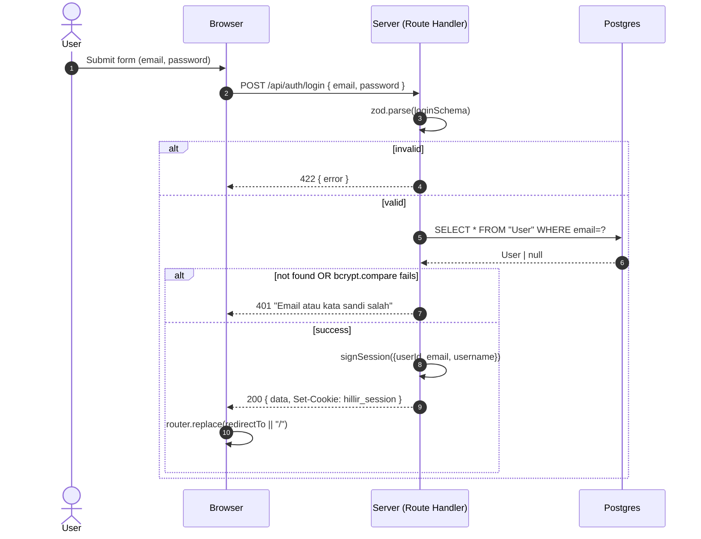
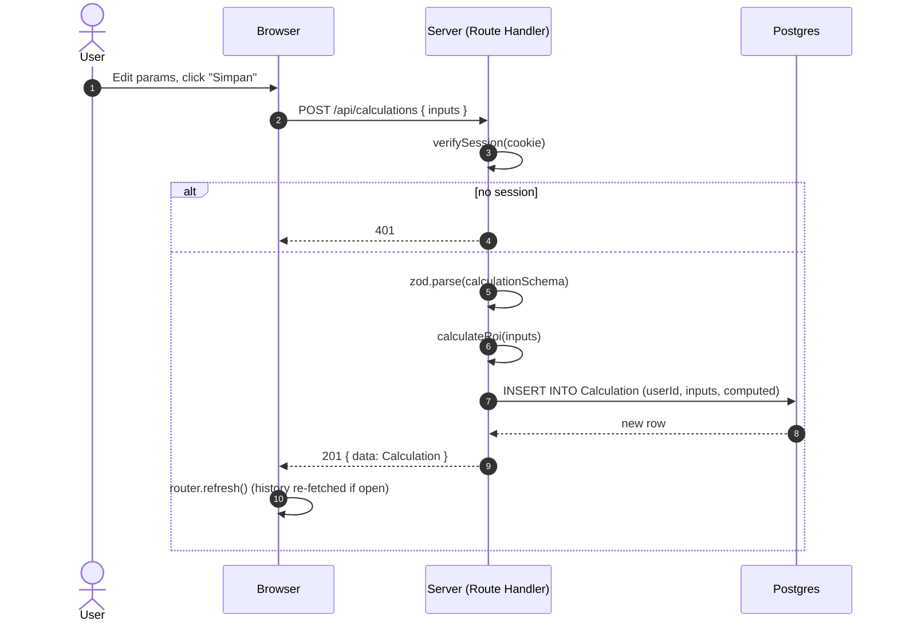

# Arsitektur AdForecast Pro

> Diagram dan penjelasan teknis lengkap tentang cara kerja aplikasi: request flow, boundary
> kepercayaan, lapisan cache, dan lifecycle data.

---

## 1. Diagram Tingkat Tinggi

```
┌──────────────────────────────────────────────────────────────────────────────┐
│                          Browser (Client / React 19)                          │
│                                                                              │
│   ┌────────────────────────────────────────────────────────────────────┐     │
│   │                    Next.js App Router (Pages)                       │     │
│   │                                                                     │     │
│   │   /login ────────► LoginForm.tsx                                    │     │
│   │   /register ─────► RegisterForm.tsx                                 │     │
│   │   / ─────────────► Calculator.tsx (RoiPanel, SliderField, …)        │     │
│   │   /history ──────► HistoryTable (Server Component)                  │     │
│   └────────────────────────────────────────────────────────────────────┘     │
│                                  │                                           │
│   fetch() JSON         Cookie: hillir_session (httpOnly)                     │
└──────────────────────────────────┼───────────────────────────────────────────┘
                                   │
                                   ▼
┌──────────────────────────────────────────────────────────────────────────────┐
│                  Next.js Server (Node runtime + Edge proxy)                  │
│                                                                              │
│   ┌────────────────────────────────────────────────────────────────────┐     │
│   │                     src/proxy.ts (Edge)                            │     │
│   │   • Verify cookie JWT → if missing on / or /history → redirect     │     │
│   │   • If logged-in user visits /login or /register → redirect to /   │     │
│   └────────────────────────────────────────────────────────────────────┘     │
│                                  │                                           │
│                                  ▼                                           │
│   ┌────────────────────────────────────────────────────────────────────┐     │
│   │               Route Handlers (src/app/api/**/route.ts)             │     │
│   │                                                                     │     │
│   │   POST /api/auth/register  ─► hash password, create user, sign JWT │     │
│   │   POST /api/auth/login     ─► verify password,        sign JWT     │     │
│   │   POST /api/auth/logout    ─► clearSessionCookie()                 │     │
│   │   POST /api/calculations   ─► getSession, validate, save           │     │
│   │   GET  /api/calculations   ─► getSession, list user-scoped rows    │     │
│   │                                                                     │     │
│   │   Shared utilities:                                              │     │
│   │   • src/lib/api/response.ts    ok() / fail() envelope              │     │
│   │   • src/lib/auth/{password,jwt,session}.ts                        │     │
│   │   • src/lib/validation.ts    zod schemas                          │     │
│   │   • src/lib/roi.ts            PURE ROI model (1 impl, 2 callers)  │     │
│   └────────────────────────────────────────────────────────────────────┘     │
│                                  │                                           │
│                                  ▼                                           │
│   ┌────────────────────────────────────────────────────────────────────┐     │
│   │               Prisma 8 Contract Client (@prisma/orm-postgres)      │     │
│   │   Typed queries from src/prisma/contract.d.ts                      │     │
│   └────────────────────────────────────────────────────────────────────┘     │
└──────────────────────────────────┼───────────────────────────────────────────┘
                                   │
                                   ▼
                          ┌──────────────────┐
                          │  PostgreSQL 18   │
                          │                  │
                          │  User (1)        │
                          │    ▲             │
                          │    │ userId      │
                          │    │ (FK, idx)    │
                          │  Calculation (N) │
                          └──────────────────┘
```

---

## 2. Request Lifecycle — Login

```
Browser                          Server                              DB
   │                                │                                  │
   │  POST /api/auth/login          │                                  │
   │  { email, password }           │                                  │
   ├───────────────────────────────►│                                  │
   │                                │  zod parse (loginSchema)         │
   │                                │  ────────────────────────────►   │
   │                                │  lookup user WHERE email=?       │
   │                                │  ◄────────────────────────────   │
   │                                │                                  │
   │                                │  bcrypt.compare(password, hash)  │
   │                                │  ────────────────────────────►   │
   │                                │  ◄────────────────────────────   │
   │                                │                                  │
   │                                │  signSession({userId,...})       │
   │                                │  (jose HS256, AUTH_SECRET)       │
   │                                │                                  │
   │  200 { success, data }         │                                  │
   │  Set-Cookie: hillir_session    │                                  │
   │  ◄─────────────────────────────│                                  │
   │                                                                      │
   │  router.replace(redirectTo || "/")                                  │
   │  router.refresh()                                                    │
```

---

## 3. Request Lifecycle — Save Calculation

```
Browser                                  Server                              DB
   │                                         │                                  │
   │  POST /api/calculations                 │                                  │
   │  { productPrice, averageOrderValue,     │                                  │
   │    adSpend, costPerResult }             │                                  │
   │  Cookie: hillir_session=JWT             │                                  │
   ├────────────────────────────────────────►│                                  │
   │                                         │  verifySession(cookie)          │
   │                                         │  ───────► jwtVerify (HS256)     │
   │                                         │  ◄────── { userId, email, … }   │
   │                                         │                                  │
   │                                         │  if !session → 401              │
   │                                         │                                  │
   │                                         │  zod parse (calculationSchema)  │
   │                                         │                                  │
   │                                         │  calculateRoi(input)            │
   │                                         │  ◄────── pure function          │
   │                                         │  { resultCount, revenue, … }    │
   │                                         │                                  │
   │                                         │  INSERT INTO Calculation        │
   │                                         │  (userId, …)                     │
   │                                         ├─────────────────────────────────►│
   │                                         │  ◄─────── new row w/ id, ts     │
   │                                         │                                  │
   │  201 { success, data: Calculation }     │                                  │
   │  ◄──────────────────────────────────────│                                  │
```

**Catatan penting**: server **tidak pernah** mempercayai nilai ROI/profit yang dikirim klien — server selalu *recompute* lewat `calculateRoi()`. Ini adalah pola "client preview, server authoritative".

---

## 4. Boundary Kepercayaan (Trust Boundary)

| Batas | Di dalam | Di luar | Implikasi |
|---|---|---|---|
| **Browser → Server** | Cookie JWT yang ditandatangani, body JSON hasil input user | — | Validasi zod di setiap endpoint. JWT diverifikasi ulang tiap request. |
| **Server → DB** | Koneksi Prisma (parameterized) | — | Tidak ada SQL mentah. Tidak ada string concatenation di query. |
| **Route Handler → DB** | — | Query yang ditulis manual | Wajib menyertakan `where({ userId: session.userId })` untuk data privat. |

---

## 5. Lapisan & Tanggung Jawab

| Lapisan | File | Tanggung Jawab |
|---|---|---|
| **Presentation** | `src/app/**/page.tsx`, `src/app/components/**` | Render UI, interaksi user |
| **API / Route Handler** | `src/app/api/**/route.ts` | Validasi input, panggil service, return envelope |
| **Service / Business Logic** | `src/lib/roi.ts`, `src/lib/auth/**` | Aturan bisnis (formula ROI, password hash/JWT) |
| **Data Access** | `src/prisma/db.ts` + `src/prisma/contract.{json,d.ts}` | Query ke Postgres via Prisma |
| **Schema Source of Truth** | `src/prisma/contract.prisma` | Model data, relasi, generated types |

Prinsip **single source of truth** untuk formula ROI: satu fungsi `calculateRoi` di `src/lib/roi.ts` dipakai oleh klien (preview) dan server (save). Tidak ada duplikasi.

---

## 6. Aliran Data: User Sign-up

```
1. User submit form (RegisterForm.tsx)
   └─ POST /api/auth/register { username, email, password }
2. Route handler
   ├─ zod.validate (registerSchema)
   ├─ DB.check duplicate (email OR username)
   ├─ hashPassword(password)  [bcrypt 12 rounds, ~250ms]
   ├─ DB.create User { username, email, passwordHash }
   ├─ signSession({ userId, email, username })  [jose HS256]
   └─ Attach cookie (httpOnly, sameSite=lax, secure=prod, maxAge=7d)
3. Browser
   └─ router.replace("/") → calculator renders
```

---

## 7. Aliran Data: Real-time Preview

```
Calculator state change (slider OR number input)
   └─ setInputs(prev => ({ ...prev, [key]: value }))
      └─ React re-renders
         └─ useMemo(() => calculateRoi(inputs), [inputs])
            └─ RoiPanel receives new result → re-renders metrics
```

Tidak ada network round-trip untuk preview. Hanya saat **save** data dikirim ke server.

---

## 8. Aliran Data: History Load

```
User navigates ke /history
   └─ Server Component (history/page.tsx)
      ├─ requireSession()  → if no session → redirect("/login")
      ├─ DB.list Calculation WHERE userId = session.userId ORDER BY createdAt DESC
      └─ Render Table (HeroUI)
```

Data privat difilter **di DB**, bukan di klien. Klien hanya menerima baris miliknya.

---

## 9. State Management

Aplikasi sengaja **tidak** memakai state manager global (Redux, Zustand). State lokal cukup karena:

- `Calculator` adalah *single-instance* per halaman.
- `LoginForm`/`RegisterForm` self-contained.
- Data persisten tinggal di server (via API).

Jika scope membesar, pertimbangkan:
- **TanStack Query** untuk caching & invalidation API.
- **Zustand** untuk state UI lintas komponen (theme, sidebar collapse).

---

## 10. Build & Deployment Pipeline

```
   ┌─────────┐    ┌─────────┐    ┌─────────┐    ┌──────────┐
   │  Local  │───▶│   CI    │───▶│ Vercel  │───▶│   Live   │
   │  dev    │    │  build  │    │ preview │    │   prod   │
   └─────────┘    └─────────┘    └─────────┘    └──────────┘
       │              │               │
   bun run dev    bun run build   auto-deploy
                  tsc --noEmit    per branch
                  bun run lint   (known issue w/ TS 7)
```

Langkah produksi:

1. `bun run build` — TypeScript strict + Turbopack production build.
2. Push ke Git → Vercel auto-deploy.
3. Database: managed Postgres (Neon, Supabase, RDS). `DATABASE_URL` di-inject.
4. `prisma db init` dijalankan sekali pada DB production (atau `prisma db update` setelah perubahan skema).

---

## 11. Observability (praktik saat ini & rekomendasi)

| Aspek | Saat Ini | Rekomendasi |
|---|---|---|
| Logging | `console.log/error` di route handlers | Pakai `pino` atau OpenTelemetry exporter |
| Error tracking | — | Tambah Sentry / Highlight.io |
| Metrics | — | Tambah Prometheus / OpenTelemetry |
| Health check | — | Endpoint `GET /api/health` untuk uptime monitor |

---

## 12. Trade-off yang Diambil

| Keputusan | Alternatif | Alasan |
|---|---|---|
| **JWT cookie (bukan DB session)** | Session table di DB | Stateless, scalable, tidak butuh lookup tiap request. Trade-off: tidak bisa revoke sesi sebelum expiry tanpa blacklist. |
| **bcrypt (bukan Argon2)** | Argon2 (PASSWORD_OWASP recommended) | `bcryptjs` lebih portabel di serverless; 12 rounds cukup untuk hardware 2024. Bisa migrasi ke `argon2` native tanpa ubah interface. |
| **Prisma 8 RC** | Prisma 6 LTS | Brief/test stack memintanya. Kontrak sebagai source-of-truth lebih type-safe. |
| **HeroUI v3 (Tailwind v4)** | shadcn/ui | Compound components, BEM, React Aria-based a11y out-of-the-box. |
| **Next.js 16 + Turbopack** | Next.js 14 LTS | Latest App Router conventions; App Router + Server Components sudah stabil. |
| **No state manager** | Redux / Zustand | State app sederhana, tidak butuh overhead. |
| **Float64 untuk uang** | Decimal/BigInt | Untuk IDR (2 desimal max) float cukup; bila butuh presisi tambah `decimal.js`. |

---

## 13. Lampiran: Sequence Diagram (Mermaid)

### 13.1 Login Flow



### 13.2 Save Calculation Flow



---

© 2024 AdForecast Pro — Arsitektur versi 2.0.